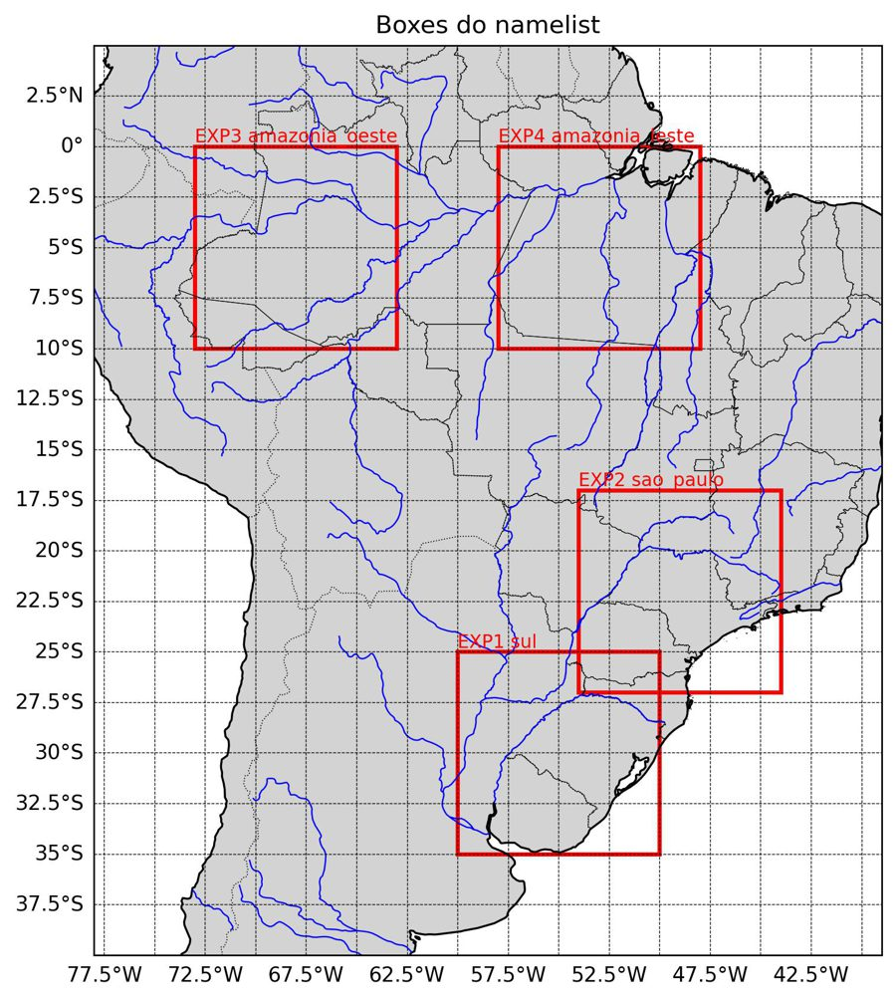
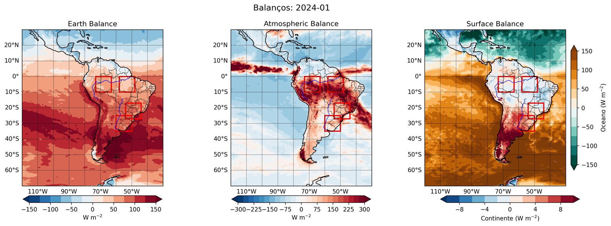
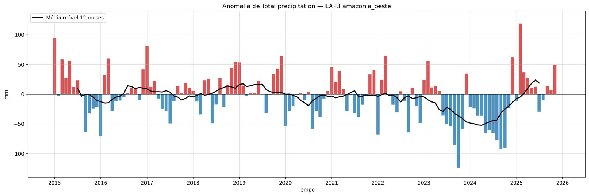
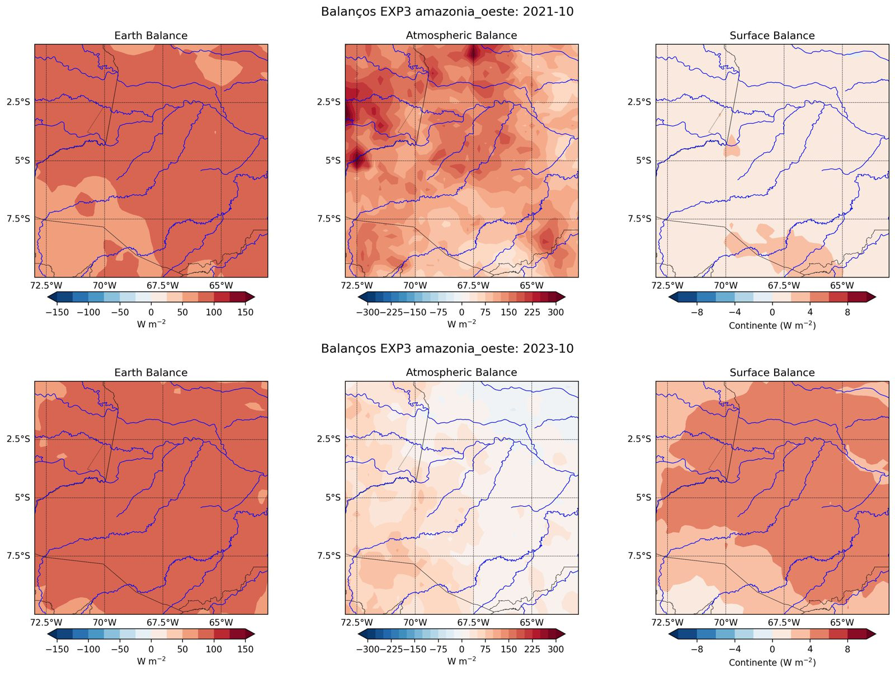
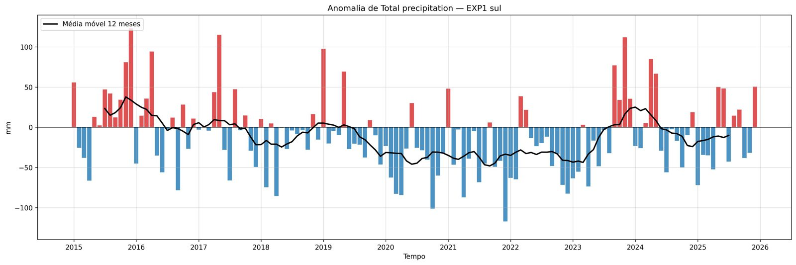
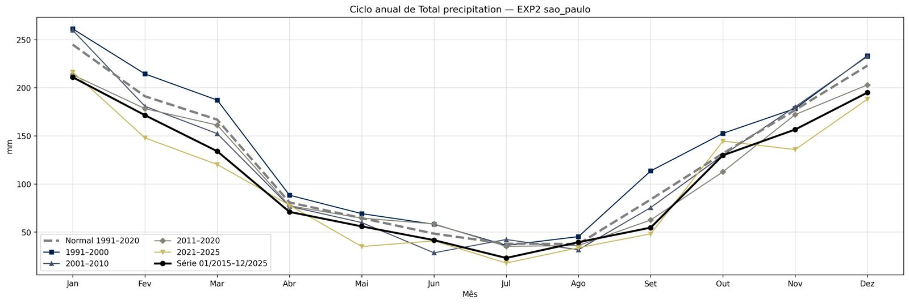
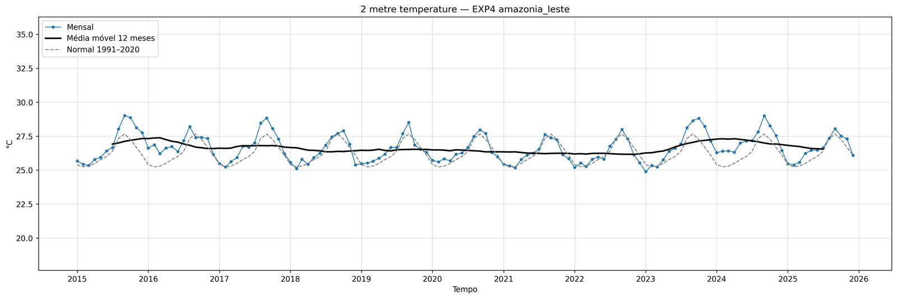

# Projeto: Balanços de Energia em Domínios Específicos

**Disciplina:** Meteorologia Tropical - IAG/USP
**Autor:** Victor Antunes Ranieri
**Data:** 2025-12-22 (reorganizado em 2026-09)

## 📋 Objetivo
Processar, analisar e visualizar os balanços de energia (topo da atmosfera, atmosfera e
superfície) e variáveis de nuvens, precipitação e fluxos de calor em regiões escolhidas
pelo usuário (boxes), usando as médias mensais da reanálise ERA5. As anomalias são
calculadas em relação à **normal climatológica 1991–2020** do mesmo domínio.

📘 Dados, normal climatológica, equações e variáveis estão detalhados em
[docs/METODOLOGIA.md](docs/METODOLOGIA.md).

## 🗂️ Estrutura de diretórios
```
├── datain/
│   ├── raw/                  # ERA5 do período de análise (get_data.py analise)
│   │   └── clima/            # ERA5 do período da normal (temporário, apagado pelo normal.py)
│   ├── processed/EXP/nome/   # recortes de cada box (slice.py)
│   └── mascara/              # máscara continente/oceano do ERA5 (get_data.py mascara)
│
├── dataout/
│   ├── tables/               # boxes.csv e tabelas CSV de cada experimento
│   ├── balanc/               # mapas mensais dos balanços no domínio total, com os boxes
│   ├── boxes.jpg             # mapa com a localização dos boxes
│   └── EXP/nome/             # figuras de cada box
│       ├── *_time_series.jpg #   séries temporais
│       ├── anomalias/        #   anomalias em relação à normal
│       ├── clima/            #   ciclo anual (normal, décadas e série)
│       ├── balanc/           #   mapas mensais dos balanços do box
│       └── mapas/<variavel>/ #   mapas mensais de cada variável
│
├── docs/
│   ├── METODOLOGIA.md        # dados, normal, equações e variáveis
│   └── img/                  # figuras de exemplo usadas no README
│
├── env/environment.yml       # ambiente conda
├── logs/download.log         # log dos downloads
├── shapefiles/               # estados do Brasil e continentes
└── scripts/
    ├── common.py             # configurações e funções compartilhadas (ver abaixo)
    ├── download/get_data.py  # download do ERA5 (análise, normal e máscara)
    ├── analysis/
    │   ├── namelist.txt      # definição dos boxes
    │   ├── normal.py         # gera a normal 1991–2020 (baixa, processa e apaga os .nc)
    │   ├── slice.py          # recorta os boxes
    │   ├── time_serie_vars.py# séries das médias em cada box + balanços
    │   ├── climatologia.py   # normal e ciclo anual da série
    │   ├── desv.py           # anomalias
    │   └── box_maps.py       # mapa com a localização dos boxes
    └── plots/
        ├── plot_vars_time_series.py  # séries temporais
        ├── plot_desv.py              # anomalias
        ├── plot_medias_mensais.py    # ciclo anual
        ├── plot_balanc_box.py        # mapas dos balanços no domínio total
        ├── plot_balanc.py            # mapas dos balanços de cada box
        ├── plot_vars.py              # mapas de cada variável
        └── nome_variavel.py          # lista as variáveis dos netCDF
```

## ⚙️ Instalação
```
git clone https://github.com/Victorrani/tropical.git
cd tropical
conda env create -f env/environment.yml
conda activate tropical-env
```
O download usa a API do Copernicus (CDS). Crie uma conta e configure o arquivo `~/.cdsapirc`
com a sua chave: https://cds.climate.copernicus.eu/how-to-api

Todos os comandos abaixo são executados a partir da raiz do projeto.

## 🚀 Fluxo de uso

### 1. Defina os boxes em `scripts/analysis/namelist.txt`
Uma linha por box. Linhas iniciadas por `#` são ignoradas.
```
exp_name=EXP1;name=sul;lat_max=-25;lat_min=-35;lon_max=-50;lon_min=-60;superficie=terra
exp_name=EXP3;name=amazonia_oeste;lat_max=0;lat_min=-10;lon_max=-63;lon_min=-73
```
| Campo | Descrição |
|---|---|
| `exp_name`, `name` | nomes das pastas de saída (`dataout/EXP1/sul/`); o par não pode se repetir |
| `lat_min`, `lat_max`, `lon_min`, `lon_max` | limites em graus; longitude entre −180 e 180 |
| `superficie` (opcional) | `todos` (padrão), `terra` ou `oceano`: quais pontos entram na média do box |

⚠️ **Prefira domínios pequenos.** A área baixada é o retângulo que envolve todos os boxes; o
`get_data.py` mostra o tamanho estimado e pede confirmação acima de 1 GB.

`superficie=terra` é recomendado em boxes com litoral: no oceano o balanço de superfície e os
fluxos de calor são muito diferentes dos do continente e contaminam a média.

### 2. Baixe a máscara continente/oceano (uma vez só)
```
python scripts/download/get_data.py mascara
```
Necessária para `superficie=terra|oceano` e para as escalas de cor separadas nos mapas.

### 3. Gere a normal climatológica 1991–2020
```
python scripts/analysis/normal.py            # baixa, processa e apaga os .nc da normal
python scripts/analysis/normal.py --manter   # mantém os .nc
```
Gera `dataout/tables/EXP/EXP_nome_normal_91_20.csv`. A primeira linha do arquivo guarda as
coordenadas e a superfície do box: **se você mudar um box no namelist, rode o `normal.py` de
novo** — o `desv.py` recusa uma normal gerada para outro domínio.

O download da normal usa sempre só a área dos boxes (a normal é calculada por box).

### 4. Baixe o período de análise
```
python scripts/download/get_data.py analise              # usa ANO_INICIO–ANO_FIM do script
python scripts/download/get_data.py analise 2023 2024    # período escolhido
```
Em `get_data.py` você configura:
- `ANO_INICIO`, `ANO_FIM`: período padrão;
- `AREA = [N, W, S, E]`: domínio dos mapas (os boxes precisam estar dentro); `None` usa a área dos boxes;
- `VARIAVEIS`: variáveis baixadas;
- `ANOS_POR_PEDIDO`: o CDS limita o tamanho de cada pedido ("Your request is too large"),
  então o período é dividido em blocos de anos e depois juntado. Se o erro aparecer, diminua esse valor;
- `TENTATIVAS`: falhas do servidor do CDS (ex.: `OperationalError`) são repetidas automaticamente.
  Se o download parar mesmo assim, rode o mesmo comando de novo: os blocos já baixados são pulados.

Os arquivos ficam em `datain/raw/` (um por tipo de variável do ERA5: `avgad`, `avgid`, `avgua`).

### 5. Processe
```
python scripts/analysis/slice.py            # recorta os boxes e gera dataout/tables/boxes.csv
python scripts/analysis/time_serie_vars.py  # séries mensais das médias em cada box
python scripts/analysis/climatologia.py     # normal, ciclo anual da série e de cada década
python scripts/analysis/desv.py             # anomalias em relação à normal
```
As médias nos boxes são ponderadas pela área (cos da latitude). Rode os scripts nessa ordem.

### 6. Gere as figuras
```
python scripts/analysis/box_maps.py               # localização dos boxes
python scripts/plots/plot_vars_time_series.py     # séries: mensal, média móvel 12 meses e normal
python scripts/plots/plot_desv.py                 # anomalias em barras + média móvel 12 meses
python scripts/plots/plot_medias_mensais.py all   # ciclo anual: normal, décadas e série atual
python scripts/plots/plot_balanc_box.py           # mapas dos balanços no domínio total
python scripts/plots/plot_balanc.py               # mapas dos balanços de cada box
python scripts/plots/plot_vars.py 12              # mapas das variáveis, só em dezembro
```
- `plot_medias_mensais.py` aceita o número, o nome abreviado (`tp_mm`) ou `all`; sem argumento, pergunta no terminal.
- Os limites do eixo y das séries são automáticos e **iguais para todos os boxes**, para facilitar a
  comparação. Para fixar o limite de uma variável, adicione-a em `LIMITES_SERIE` ou
  `LIMITES_ANOMALIA` no `scripts/common.py`.
- Nos mapas, com a máscara baixada, o balanço de superfície (e os fluxos de calor sensível e
  latente) usa escalas de cor separadas para continente e oceano: no oceano o saldo mensal é
  muito maior, pois ele armazena e transporta calor.
- `plot_vars.py` gera um mapa por variável, mês e box, para todos os anos dos meses escolhidos:
  `12` (dezembro), `12 1 2` (verão), `all` (todos os meses — milhares de figuras). Para escolher
  variáveis: `--vars tp avg_slhtf`. Sem argumentos, o script pergunta os meses.

## 📊 Exemplos de resultados
Exemplos de um teste com o período de **2015–2025** (ERA5 no domínio 30°N–70°S, 120°W–30°W) e
anomalias em relação à normal 1991–2020. Os boxes têm 10° × 10°; em `sul` e `sao_paulo` a média
usa só o continente (`superficie=terra`).

### Domínios


| Box | Região | lat | lon |
|---|---|---|---|
| `EXP1 sul` | RS, Uruguai e nordeste da Argentina | −35 a −25 | −60 a −50 |
| `EXP2 sao_paulo` | estado de São Paulo | −27 a −17 | −54 a −44 |
| `EXP3 amazonia_oeste` | oeste da Amazônia | −10 a 0 | −73 a −63 |
| `EXP4 amazonia_leste` | leste da Amazônia | −10 a 0 | −58 a −48 |

### Balanços de energia no domínio total (janeiro de 2024)


### Anomalia de chuva no oeste da Amazônia


### Mapas de um box: oeste da Amazônia, outubro de 2021 x outubro de 2023
Exemplo dos mapas gerados para cada box (`plot_balanc.py`), comparando um outubro chuvoso
(2021, La Niña, em cima) com o auge da seca (2023, embaixo):



| Média no box (outubro) | 2021 | 2023 | Normal 1991–2020 |
|---|---|---|---|
| Chuva (mm) | 189 | **68** | 192 |
| Balanço atmosférico (W m⁻²) | 131 | **30** | 131 |
| Calor sensível (W m⁻², para cima) | 34 | **57** | 31 |
| Calor latente (W m⁻², para cima) | 122 | 109 | 121 |
| Temperatura a 2 m (°C) | 26,6 | **28,2** | 26,3 |

### Anomalia de chuva no Sul


### Ciclo anual da chuva em São Paulo


### Temperatura no leste da Amazônia


## ⏱️ Tempo estimado
Tempos medidos em um computador pessoal (7 GB de RAM) com 24 variáveis. Os downloads dependem
da fila do CDS e da conexão, e podem variar bastante.

| Etapa | Exemplo | Tempo |
|---|---|---|
| Máscara continente/oceano | global, 1 campo (~1 MB) | < 1 min |
| Normal 1991–2020 (`normal.py`) | área dos boxes, 30 anos em 6 pedidos | ~15–20 min |
| Análise, área pequena | ~11° × 9°, 9 anos em 2 pedidos | ~4 min |
| Análise, domínio grande | 100° × 90° (0,9 GB), 11 anos em 3 pedidos | ~18 min (~7 min por bloco de 5 anos) |
| Processamento (`slice.py` → `desv.py`) | 4 boxes, 132 meses | < 30 s |
| Séries, anomalias e ciclo anual | 4 boxes, ~30 variáveis | ~2–3 min |
| Mapas dos balanços, domínio total (`plot_balanc_box.py`) | 100° × 90°, 132 meses | ~4 min (~1,6 s por mapa) |
| Mapas dos balanços por box (`plot_balanc.py`) | 4 boxes × 132 meses | ~10 min (~1,2 s por mapa) |
| Mapas das variáveis (`plot_vars.py 12 --vars tp avg_ishf`) | 2 variáveis × 4 boxes × 11 dezembros | ~1 min (~0,7 s por mapa) |
| Mapas das variáveis (`plot_vars.py all`) | 24 variáveis × 4 boxes × 132 meses (~12 mil mapas) | ~2–3 h (estimado pelo tempo por mapa) |

Cada pedido ao CDS passa por uma fila (em geral de segundos a poucos minutos) antes do
download. Para domínios grandes, o tempo de transferência domina.

## 📈 Equações de balanço
Calculadas em `common.calcula_balancos`, com os fluxos na convenção original do ERA5
(**positivo para baixo**):

| Balanço | Equação |
|---|---|
| Terra (topo da atmosfera) | `R_topo = SW_liq,topo + LW_liq,topo` |
| Superfície | `R_sup + SH + LH`, com `R_sup = SW_liq,sup + LW_liq,sup` |
| Atmosfera | `(R_topo − R_sup) − SH + L·P` |

`SH` e `LH` são os fluxos de calor sensível e latente, `P` a taxa de precipitação e
`L = 2,5×10⁶ J kg⁻¹`. No balanço atmosférico entra o calor liberado pela precipitação (`L·P`);
a diferença para o balanço de superfície é compensada pelo transporte horizontal de energia.

## 🧾 Variáveis nas tabelas
As colunas seguem o formato `abreviação (unidade) (nome completo)`.

| Abreviação | Unidade | Descrição |
|---|---|---|
| `t2m`, `d2m` | K e °C | temperatura e ponto de orvalho a 2 m |
| `tcc`, `hcc`, `mcc`, `lcc` | 0–1 | cobertura de nuvens total, alta, média e baixa |
| `cbh` | m | altura da base das nuvens |
| `tcw`, `tcwv` | kg m⁻² | água e vapor d'água na coluna |
| `tp` | mm dia⁻¹ | precipitação total (média diária do mês) |
| `tp_mm` | mm | precipitação total acumulada no mês |
| `avg_tprate` | kg m⁻² dia⁻¹ (= mm dia⁻¹) | taxa de precipitação |
| `avg_tprate_W` | W m⁻² | calor latente liberado pela precipitação (`L·P`) |
| `avg_ie` | kg m⁻² dia⁻¹ | fluxo de umidade (evaporação; negativo = para cima) |
| `avg_vimdf` | kg m⁻² dia⁻¹ | divergência do fluxo de umidade integrado na coluna |
| `avg_slhtf`, `avg_ishf` | W m⁻² | calor latente e sensível na superfície ⁽*⁾ |
| `avg_snswrf`, `avg_snlwrf` | W m⁻² | saldo de onda curta e longa na superfície ⁽*⁾ |
| `avg_sdswrf`, `avg_sdlwrf`, `avg_sdirswrf`, `avg_sduvrf` | W m⁻² | radiação descendente na superfície (OC, OL, OC direta, UV) |
| `avg_tnswrf`, `avg_tnlwrf` | W m⁻² | saldo de onda curta e longa no topo ⁽*⁾ |
| `avg_tdswrf` | W m⁻² | onda curta incidente no topo |
| `balanc_earth`, `balanc_surface`, `balanc_atmos` | W m⁻² | balanços de energia |

⁽*⁾ Nas tabelas e figuras, esses fluxos estão com o **sinal invertido** em relação ao ERA5
(positivo para cima). Os balanços são calculados antes da inversão.

Variáveis em "por segundo" do ERA5 são convertidas para "por dia" (× 86400).

## 🔧 Configurações compartilhadas (`scripts/common.py`)
- caminhos do projeto (a raiz pode ser trocada pela variável de ambiente `TROPICAL_ROOT`, útil para testes);
- `NORMAL` (1991–2020) e `COBERTURA_MINIMA` (fração mínima de anos com dados para calcular uma década);
- `LIMITES_SERIE`, `LIMITES_ANOMALIA` (limites fixos opcionais dos gráficos);
- equações de balanço, leitura do namelist e da máscara, funções de mapa.

## 🔜 Próximos passos
- Script único que roda todo o fluxo em ordem (os scripts continuam utilizáveis separadamente).
- Opção de plotar só alguns meses/variáveis no `plot_vars.py`.

## Dúvidas?
Entre em contato pelos emails victor.ranieri@usp.br ou victor.ranieri90@gmail.com
